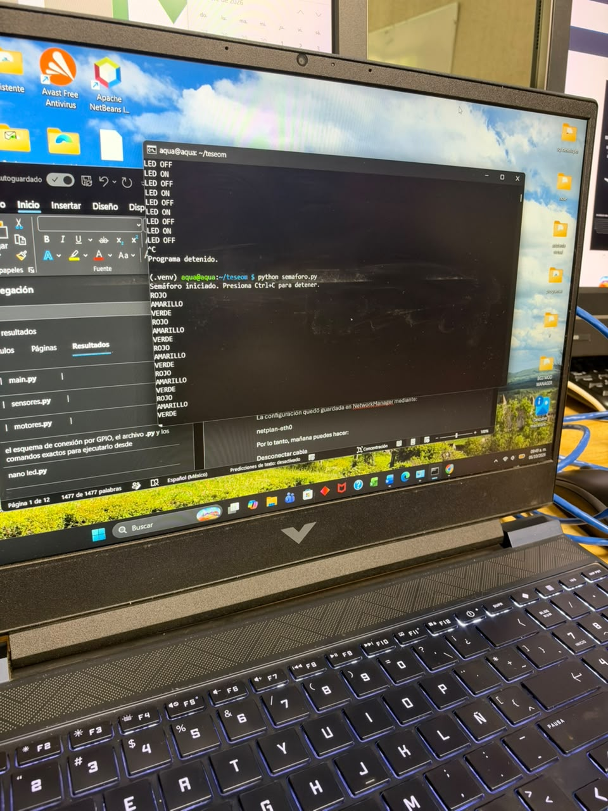

# P1_LedBlink

Encender y apagar un LED desde una Raspberry Pi 5. El LED queda 5 segundos encendido y 5 segundos apagado.

El programa está en [`led.py`](led.py). La misma documentación está en [`P1_LedBlink.docx`](P1_LedBlink.docx).

## Equipo

- Laptop con Windows
- Raspberry Pi 5
- Cable Ethernet directo entre las dos
- Protoboard, cables Dupont
- 1 LED
- 1 resistencia de 220 Ω a 330 Ω

## Conexión de la laptop con la Raspberry Pi

La Pi se programa desde la laptop por SSH. No se usó teclado ni monitor en la Pi, ni Wi-Fi ni Internet.

| Equipo | IP |
| --- | --- |
| Laptop | `192.168.50.1` |
| Raspberry Pi | `192.168.50.2` |

```text
Laptop  192.168.50.1
   │
   │  Ethernet
   │
Raspberry Pi  192.168.50.2
```

La IP de la Pi quedó guardada en NetworkManager con el perfil `netplan-eth0`. Para volver a trabajar basta con conectar el Ethernet, encender los dos equipos y, en CMD:

```text
ssh aqua@192.168.50.2
```

La sesión abre en `aqua@aqua:~ $`. La laptop tiene que conservar la IP `192.168.50.1`. Si Windows pone ese adaptador en DHCP, el SSH no entra hasta volver a fijar la IP.

## Entorno

Los programas están en `~/teseom`, dentro del entorno virtual `.venv`.

```text
cd ~/teseom
source .venv/bin/activate
```

El control del LED usa `gpiozero`:

```text
pip install gpiozero
```

## Conexión del LED

El LED usa **GPIO17**, pin físico **11**. La tierra es el pin físico **6**. Entre el GPIO y el LED va la resistencia. El LED no se conecta directo al GPIO.

| Señal | Pin físico | Hacia dónde |
| --- | --- | --- |
| GPIO17 | 11 | Resistencia y después la pata larga (+) del LED |
| GND | 6 | Pata corta (−) del LED |

```text
Pin 11 (GPIO17) ── resistencia 220–330 Ω ──►|── GND (pin 6)
                                            LED
```

## Programa

Archivo: `led.py`, creado con `nano` dentro del entorno virtual. Guardar en nano: `Ctrl+O`, Enter, `Ctrl+X`.

```python
from gpiozero import LED
from time import sleep

led = LED(17)

print("LED iniciado. Presiona Ctrl+C para detener.")

try:
    while True:
        led.on()
        print("LED ON")
        sleep(5)

        led.off()
        print("LED OFF")
        sleep(5)

except KeyboardInterrupt:
    led.off()
    print("\nPrograma detenido.")
```

## Ejecución

```text
cd ~/teseom
source .venv/bin/activate
python led.py
```

La terminal imprime:

```text
LED iniciado. Presiona Ctrl+C para detener.
LED ON
LED OFF
LED ON
LED OFF
```

El ciclo es 5 segundos encendido y 5 segundos apagado. `Ctrl+C` apaga el LED y muestra `Programa detenido.`

## Evidencia

El video no tiene audio. Dura unos 15 segundos y muestra la Raspberry Pi, la protoboard y el LED verde pasando de encendido a apagado.

Video: [evidencia/video_encendido_apagado.mp4](evidencia/video_encendido_apagado.mp4)

La toma de la laptop junta esta práctica con el semáforo, porque las dos salidas quedaron en la misma terminal. Primero se ve `LED ON` / `LED OFF` y `Programa detenido.`

Video: [evidencia/video_led_y_semaforo.mp4](evidencia/video_led_y_semaforo.mp4)


