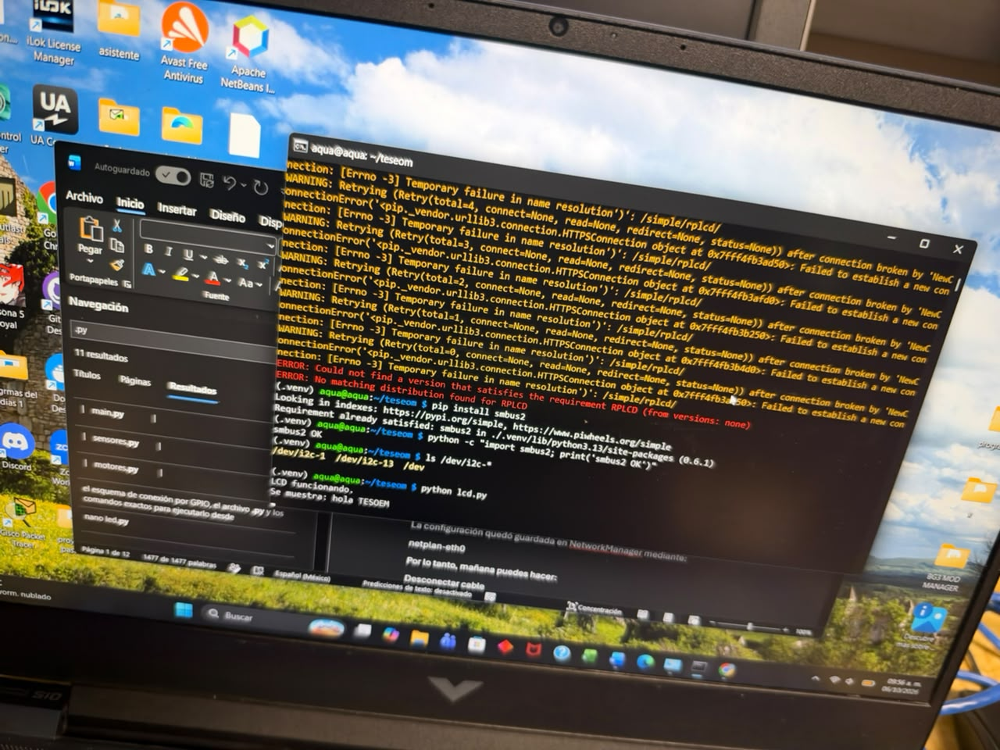

# P3_HolaMundoLCD

Mostrar el texto `hola TESOEM` en un LCD 20x4 conectado por I²C a una Raspberry Pi 5.

El programa está en [`lcd.py`](lcd.py). La misma documentación está en [`P3_HolaMundoLCD.docx`](P3_HolaMundoLCD.docx).

## Equipo

- Laptop con Windows
- Raspberry Pi 5
- Cable Ethernet directo entre las dos
- LCD 20x4 con adaptador I²C de 4 pines: `GND`, `VCC`, `SDA`, `SCL`
- 4 cables Dupont

## Conexión de la laptop con la Raspberry Pi

La Pi se programa desde la laptop por SSH. Esa Ethernet no tiene Internet.

| Equipo | IP |
| --- | --- |
| Laptop | `192.168.50.1` |
| Raspberry Pi | `192.168.50.2` |

```text
Laptop  192.168.50.1
   │
   │  Ethernet
   │
Raspberry Pi  192.168.50.2
```

La IP de la Pi quedó guardada en NetworkManager con el perfil `netplan-eth0`. Para entrar, en CMD:

```text
ssh aqua@192.168.50.2
```

La laptop tiene que conservar la IP `192.168.50.1`.

## Entorno

```text
cd ~/teseom
source .venv/bin/activate
```

`smbus2` ya estaba instalado en el entorno y es la librería que usa el programa:

```text
pip install smbus2
python -c "import smbus2; print('smbus2 OK')"
```

La salida fue `smbus2 OK`.

`RPLCD` no se pudo instalar. `pip install RPLCD` falló con `Temporary failure in name resolution` porque la red entre la laptop y la Pi no tiene DNS ni Internet. Por eso el controlador del LCD está escrito en `lcd.py` sobre `smbus2`.

## Conexión del LCD

Se conectó con la Raspberry apagada. Los cuatro pines del módulo son `GND`, `VCC`, `SDA` y `SCL`.

| LCD | Raspberry Pi 5 | Pin físico |
| --- | --- | --- |
| GND | GND | 6 |
| VCC | 5 V | 2 |
| SDA | GPIO2 / SDA | 3 |
| SCL | GPIO3 / SCL | 5 |

```text
GND  →  pin 6
VCC  →  pin 2 (5 V)
SDA  →  pin 3
SCL  →  pin 5
```

`VCC` va a 5 V, no a un GPIO. `SDA` y `SCL` van a los pines I²C, no a 5 V. GND y VCC no se intercambian.

## Activar y detectar I²C

I²C se habilitó con:

```text
sudo raspi-config
```

Ruta: **Interface Options → I2C → Enable**. Después, `sudo reboot`. Al volver:

```text
ssh aqua@192.168.50.2
cd ~/teseom
source .venv/bin/activate
sudo apt install -y i2c-tools
sudo i2cdetect -y 1
```

En la fila `20` apareció `27`. La dirección del LCD es **0x27** en el bus **1**.

```text
ls /dev/i2c-*
```

Mostró `/dev/i2c-1`, `/dev/i2c-13` y `/dev/i2c-14`. El programa usa `/dev/i2c-1`, el mismo bus en el que `i2cdetect` encontró el `27`.

## Programa

`lcd.py` inicializa el controlador HD44780 en modo de 4 bits a través del adaptador I²C y escribe `hola TESOEM` en la primera línea. El código completo está en [`lcd.py`](lcd.py).

Datos que usa el programa:

| Dato | Valor |
| --- | --- |
| Dirección I²C | `0x27` |
| Bus | `1` |
| Texto | `hola TESOEM` |

## Ejecución

```text
python lcd.py
```

Salida en la terminal:

```text
LCD funcionando.
Se muestra: hola TESOEM
```

En la pantalla se lee `hola TESOEM`. El programa se queda en espera para que el texto no se borre al salir. `Ctrl+C` lo detiene y muestra `Programa detenido.`

## Evidencia





