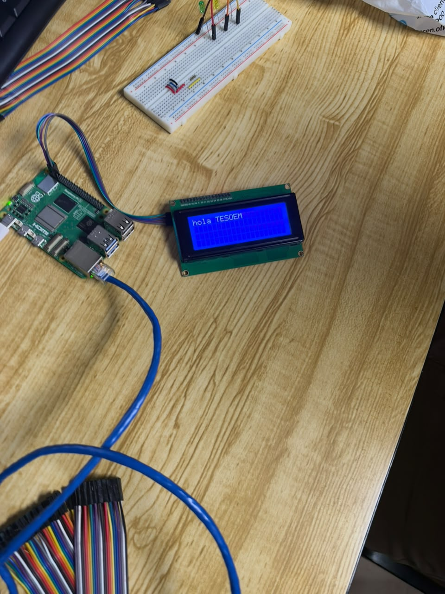
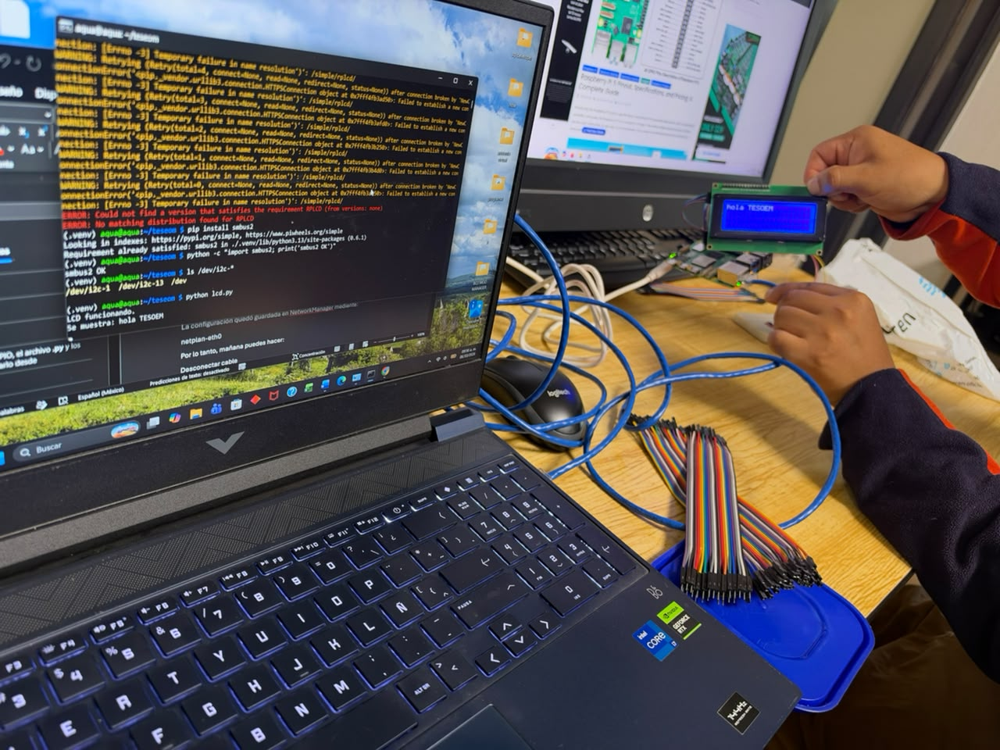

# Documentación de sistemas embebidos

Prácticas hechas en una Raspberry Pi, dentro de la carpeta `~/tesoem`, con el entorno virtual `.venv` y el usuario `aqua`.

Esta documentación explica qué se hizo en cada demostración y qué evidencia la acompaña. Las fotos y los videos están separados por práctica. Los videos se subieron **sin audio**.

## 1. Encender y apagar un LED

El programa del LED enciende y apaga un LED verde conectado a la Raspberry Pi por la protoboard. En la terminal la salida se alterna así:

```text
LED ON
LED OFF
LED ON
LED OFF
```

Al detenerlo con Ctrl+C imprime `Programa detenido.`

El video dura unos 15 segundos. Muestra la Raspberry Pi alimentada por USB, el cable de red, la protoboard y el LED verde pasando de encendido a apagado. En el mismo plano se ve la pantalla LCD, todavía sin el texto de la tercera práctica.

Video: [evidencia/led/video_encendido_apagado.mp4](evidencia/led/video_encendido_apagado.mp4)

La misma ejecución, ya detenida, queda en la captura de la sección de terminal.

## 2. Semáforo

Después del LED se ejecutó:

```text
python semaforo.py
```

El programa avisa `Semáforo iniciado. Presiona Ctrl+C para detener.` y recorre el ciclo en este orden:

```text
ROJO
AMARILLO
VERDE
```

El ciclo se repite. En la protoboard hay tres LED (rojo, amarillo y verde), cada uno con su resistencia.

El video dura unos 5 segundos y es un acercamiento de esa protoboard. Al inicio está encendido el rojo y después pasa al verde.

Video: [evidencia/semaforo/video_secuencia.mp4](evidencia/semaforo/video_secuencia.mp4)

## 3. Hola mundo en la pantalla LCD

La pantalla es un LCD de 16x2 con backlight azul, conectado por I2C a la Raspberry Pi. Antes de correr el programa, en la terminal se ve esta preparación:

1. `pip install smbus2`, porque la librería `RPLCD` lo pedía y no había red para bajar `RPLCD` en ese momento.
2. Comprobación del bus I2C con `ls /dev/i2c-*`, que mostró `/dev/i2c-1` y `/dev/i2c-13`.
3. Prueba rápida: `python -c "import smbus2; print('smbus2 OK')"`, con resultado `smbus2 OK`.
4. Ejecución: `python lcd.py`.

La salida del programa fue:

```text
LCD funcionando.
Se muestra: hola TESOEM
```

En la pantalla física se lee `hola TESOEM` en la primera línea.






## Terminal del LED y del semáforo

Estas dos capturas juntan las dos primeras prácticas, por eso van en su propia carpeta y no se cortaron a la mitad.

El video dura unos 9 segundos. En la laptop se ve primero la salida `LED ON` / `LED OFF` y `Programa detenido.`, y enseguida el comando `python semaforo.py` con el ciclo `ROJO`, `AMARILLO`, `VERDE`. Al fondo está la protoboard con los LED. No tiene audio.

Video: [evidencia/terminal/video_led_y_semaforo.mp4](evidencia/terminal/video_led_y_semaforo.mp4)


## Dónde está cada archivo

| Práctica | Archivo | Qué muestra |
| --- | --- | --- |
| LED | `evidencia/led/video_encendido_apagado.mp4` | LED verde encendiendo y apagando |
| Semáforo | `evidencia/semaforo/video_secuencia.mp4` | Secuencia rojo, amarillo y verde |
| LCD | `evidencia/lcd/foto_pantalla_hola_tesoem.jpg` | Texto `hola TESOEM` en la pantalla |
| LCD | `evidencia/lcd/foto_terminal_lcd.jpg` | Comando `python lcd.py` y su salida |
| LCD | `evidencia/lcd/foto_montaje_general.jpg` | Equipo completo durante la prueba de la LCD |
| LED y semáforo | `evidencia/terminal/video_led_y_semaforo.mp4` | Las dos ejecuciones seguidas en la terminal |
| LED y semáforo | `evidencia/terminal/foto_terminal_led_y_semaforo.jpg` | La misma salida, en una sola foto |
